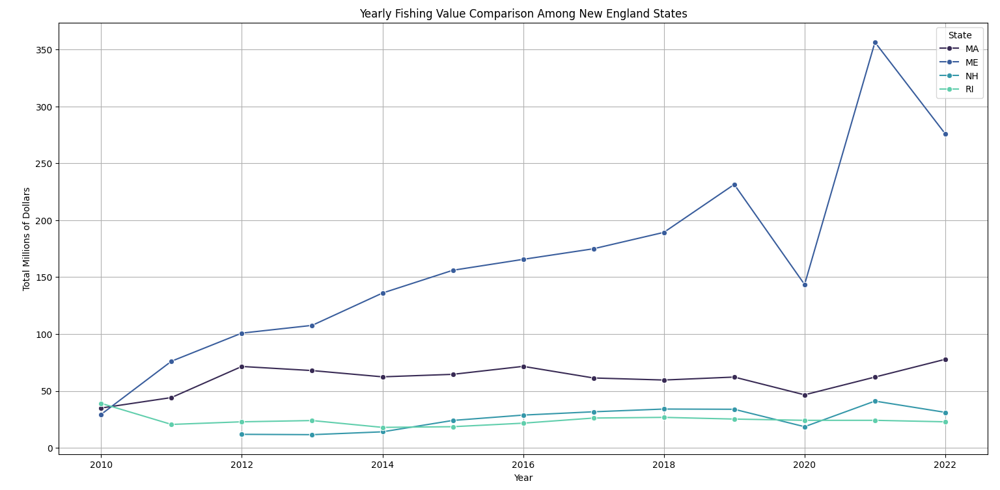

# EDA

The Exploratory Data Analysis (EDA) focus on demonstrating the data accessibility and visualizing the data in a manner that adds insights to the project's analytic objectives and proposal. The EDA aims to support the feasibility of the project objectives through various figures. The following information highlights data on fish landings, economic values, revenue, price ranges, imports, exports, and other related metrics for Haddock and Atlantic Cod, among other aspects of the fishing industry. 

## Data Accessibility and Visualization:


### 1- Landing Volumes and Values

File Name: FossLandings.csv

Description: This dataset contains records of domestic Cod and Haddock landings from 2010 to 2022

Source:
The data was sourced from the NOAA Fisheries

How to Reproduce This Dataset:

To reproduce follow these steps:

```
make trends
```
Produces these graphs...


 
- The peak in value for cod in 2013 could reflect a high abundance or a high market price at that time, followed by a decline possibly due to reduced catches, changes in market prices, or regulatory measures.
- Haddock's value has not seen such extreme changes but does show some year-to-year volatility, with a notable peak in 2018.
- The overall trend for both species is a decline in the economic value of landings from the peak years, although haddock shows some signs of recovery in the most recent years.
- The declining value of cod landings may have significant implications for fishermen, the local economy, and fishery management in New England, possibly indicating changes in stock levels, regulatory constraints, or market conditions.
- The fluctuations in haddock value suggest different or possibly less severe pressures on this fishery compared to cod.
- The recent modest increase in haddock value may indicate either improved landings, increased market prices, or a combination of both.


- The volume of Atlantic cod landings has been decreasing steadily, suggesting a decline in cod stocks, stricter regulations, or changes in fishing practices.
- Haddock landings are more variable, with peaks suggesting occasional good years for haddock catches or changes in regulations that might have allowed for higher landings in certain years.
- The trends indicate that the two species may be experiencing different pressures or management strategies.
- The steady decline in cod landing volume could be of concern for fishery managers, indicating the need for conservation efforts or a response to existing conservation measures.
- The variability in haddock landings might suggest a more resilient stock or different fishing regulations affecting the availability of haddock for landings.
- Understanding the cause behind these trends is important for managing fish stocks sustainably. This would involve looking into factors such as overfishing, habitat changes, predator-prey relationships, and climate change impacts on marine ecosystems.


These data points can be used to analyze the health and dynamics of the fisheries, as well as potential economic impacts, aligning with the proposal's objective to understand trends in the domestic fishery.

--------------------------------------------------------------------------------------------------------------------------------------


### 2- Revenue and Price Range by Category

In this section, we intend to analyze the average price of Cod and Haddock along with total revenue in the Portland auction. The data is collected from Poertland Fish Exchange website.

File Name: pfex_report.csv

Description: This dataset contains records of Portland Auction trades prices from 2010 to 2023

Source:
The data was sourced from Portland Fish Exchange

How to Reproduce This Dataset:

The following command...
```
make auction
```
Produces this graph...

.png)

- Both cod and haddock experienced price peaks around 2012, followed by a decline.
- Cod prices have more pronounced fluctuations compared to haddock prices, which are relatively more stable over the years.
- The prices of both fish types seem to move in a similar pattern with cod generally priced higher than haddock, except for the initial years.
- Both cod and haddock show a downward price trend in 2024, suggesting a possible market shift or increase in supply.
- The similarity in price trends could suggest that these two species are affected by similar market or environmental factors.
- The generally higher price of cod might reflect a greater preference for cod or potentially smaller supply relative to demand compared to haddock.
- The sharp decreases in 2024 could be indicative of a change in the market, such as shifts in consumer preference, increased quotas or catch sizes, or other economic factors.

The following command...
```
make auction_prices
```
Produces these graphs...


- There was a peak in prices for most species around 2013 and another in 2016 and 2017.
- There is variability in the price ranges across different years and species sizes, but a general trend is hard to discern without statistical analysis.
- The chart suggests that larger sizes tend to command higher prices, which is typical in fish markets due to consumer preferences and processing yields.
- The data indicates that market factors affect the price ranges of fish and that these factors vary by year and by the size of the fish.
- Peaks in prices may correlate with supply constraints, increased demand, or other economic factors affecting the fishing industry.


- There is a substantial drop in revenue for both cod and haddock after 2011, which continues throughout the decade.
- The chart indicates that the highest revenue years were at the beginning of the decade, particularly for cod.
- Cod, especially "market" size, generally generated more revenue than haddock in the years it was sold, reflecting either a higher volume of sales, a higher price point, or a combination of both.
- Haddock, while still contributing to revenue, did so to a lesser extent, which could be due to lower catch volumes, lower prices, or both.
- The sharp decrease in revenue after 2011 could suggest overfishing leading to quota reductions, changes in fish populations, market changes, or regulatory actions that impacted the industry.
- The consistently low revenue for "scrod" and "snapper" sizes across both species indicates that these categories are either less abundant, less valuable, or both.
- The peak in 2018 for "scrod" size haddock suggests a temporary market condition that favored this size, such as a shortage of other sizes or temporary spikes in demand.


This graphs provides insights into market dynamics, consumer preferences, and economic factors affecting the fisheries, supporting the proposal's aim to evaluate competition between local and imported whitefish and identify key factors impacting the domestic fishery.

-------------------------------------------------------------------------------------------------------------------------------------


### 3- Import and Export Trends

File Names: Imports.csv , Exports.csv

Description: This dataset contains records of imported Cod and Haddock from 2010 to 2023

Source:
The data was sourced from the NOAA Fisheries

How to Reproduce This Dataset:

```
make imports
```
Produces this graph...


- The volume and value trends do not always align perfectly for each country, suggesting differences in unit price or valuation of imports year by year.
- Both graphs demonstrate that import volume and value for these countries are subject to significant fluctuations, indicating possible sensitivity to economic conditions, market demand, or supply factors.
- Iceland and Norway have shown more extreme changes in both volume and value compared to the other countries, which could reflect their economic reliance on fish imports and exports or changes in their domestic fishing industries.
- The import patterns for Russia are the most erratic among the five countries, which could be influenced by political and trade dynamics or other external factors.
- Denmark's and England's relatively stable trends suggest a consistent market demand or supply situation for imports.
- The recent trends, especially around 2020, might be influenced by the COVID-19 pandemic, which has affected global trade and supply chains.

The following command...
```
make importfish
```
Produces this graph...


- Cod has consistently been imported in greater volumes than haddock from 2010 to 2022.
- Both cod and haddock experienced a peak in import volume in 2013, but cod's peak is much higher.
- The declining trend in import volume starting from around 2018 for cod and from 2021 for haddock could be indicative of a decrease in demand, changes in consumer preferences, increased import regulations, or other market dynamics.
- The sharp decline in both cod and haddock import volumes in 2022 could be the result of several factors such as supply chain disruptions, economic downturns, changes in dietary trends, or sustainability concerns affecting fishing practices and quotas.


In this section, we intend to analyze the value and volume of the exported Cod and Haddock. The data is collected from NOAA fisheries website.


The following command...
```
make exports
```
Produces this graph...


- Both the volume and the value of exports have decreased over the years, with a noticeable acceleration in the decline from 2019 onwards.
- The steep drop in both volume and value from 2021 to 2024 could be indicative of major disruptions in the market or other significant factors, such as economic downturns, changes in global trade policies, environmental issues affecting production, or the aftermath of the COVID-19 pandemic.
- The differences between volume and value peaks suggest that the unit value of exports has been variable and may have been influenced by factors other than volume, such as changes in commodity prices.
- The data suggests that there could be a problem in the export sector, which could be due to a decrease in demand, an increase in competition, or other external economic conditions.


These trends are directly relevant to the proposal's goal of evaluating competition between the domestic fishery and imports, and can help quantify the impact of imports on the local fishery and inform the analysis of trade flow dynamics.

-------------------------------------------------------------------------------------------------------------------------------------


### 4- Fishing Value and Tonnage by State and Port

File Name: PortLandings.csv

Description: This dataset contains records of domestic ports landings from 2010 to 2022

Source:
The data was sourced from the NOAA Fisheries

How to Reproduce This Dataset:

```
make ports
```
Produces these graphs...


- The port with the highest tonnage is Rockland, ME, with just over 30 million pounds of fish caught.
- The concentration of high tonnage in Maine ports could reflect the state's strong fishing industry and possibly its favorable geographic and oceanographic conditions for marine life.
- This distribution might also reflect the scale of fishing operations, with certain ports being hubs for larger commercial fishing fleets.
- The data might influence resource management, economic planning, and conservation efforts, as it indicates which ports are most significant in terms of fishing activity.


- Maine experiences the most significant variation in fishing tonnage, with peaks and troughs throughout the years, indicating a possible variability in fishing yields or fish populations.
- Massachusetts demonstrates more stability in its fishing industry, although it does show a slight decline over the period.
- Rhode Island and New Hampshire have much lower fishing tonnages, which could reflect smaller fishing industries or possibly stricter regulations or conservation efforts.
- The sharp increase in Maine's fishing tonnage in the last year suggests a notable event or change in the industry, such as a bumper year for fishing, regulatory changes, or shifts in market demand.
- Maine's significant increase in 2022 could have implications for the state's economy and may require analysis of sustainability and fish stock health.
- The overall downward trend in Rhode Island could be a cause for concern for the state's fishing industry and might prompt examination of the factors influencing these numbers.
- The relative stability of Massachusetts suggests a possibly well-managed fishery, but the slight decline could still merit investigation to ensure long-term sustainability.
- The consistently low numbers for New Hampshire may reflect the state's smaller coastline and subsequent lower fishing activity, or potentially more stringent fishing regulations



- Maine leads in fishing value, which correlates with the fishing tonnage, suggesting that the state may be fishing more valuable species or receiving better market prices.
- The peak in value in 2021 for Maine is notable and could be due to a variety of factors such as an increase in the prices of fish, changes in the types of fish caught, or perhaps a significant one-time event affecting the industry.
- The other states have much lower values that correspond to their lower tonnage figures.


This data highlights the importance of the fishing industry to specific states and ports, supporting the proposal's objective to analyze regional economic impacts and the role of local fishermen and seafood suppliers in the domestic fishery.

----------------------------------------------------------------------------------------------------------------------------------


### 5- Comparison of Import and Landing Values and Volumes

File Name: FossLandings.csv, Imports.csv

In this section, we intend to acompare the value and volume of the domestic and imported Cod and Haddock. The data is collected from NOAA fisheries website

Source:
The data was sourced from the NOAA Fisheries

How to Reproduce This Dataset:

The following command...
```
make domimport
```
Produces these graphs...


- Import volume has generally been on the rise since a dip in 2014, possibly indicating a growing demand that domestic landings cannot fulfill.
- Landing volume shows a decline, particularly from 2019 onwards, which may be due to a variety of factors such as overfishing leading to decreased stocks, stricter fishing regulations, COVID-19 or environmental changes affecting fish populations.
- The increasing gap between import and landing volumes over the years suggests that reliance on imported fish is growing, which could have implications for domestic fishing industries and global seafood trade.
- The data could reflect a need to increase sustainable fishing practices domestically to support the demand for seafood.
- The steady import volume growth could also signal changes in consumer preferences, possibly towards species not readily available from domestic landings.
- The decline in landing volumes suggests that there may be issues of concern for local fisheries, which could benefit from further investigation and potential policy or management changes to support sustainability and livelihoods.


- The import value's consistent rise could reflect an increasing demand for seafood not met by domestic landings, potential increases in seafood prices, or a shift towards importing more expensive species.
- The flat trend in landing value suggests that the domestic catch may not be growing in economic value, which could be due to a variety of factors including catch composition, market prices, or fishing regulations.
- The disparity between the import and landing values widening over time may indicate a reliance on imports to satisfy consumer demand for seafood, possibly impacting domestic fishing industries.
- The growing gap between import and landing values could lead to economic concerns for the domestic fishing industry, emphasizing the need for strategies to enhance the value of domestic landings.
- Policymakers might consider this information when making decisions regarding fishery management, sustainability practices, and support for local fishers.


------------------------------------------------------------------------------------------------------------------------------------


## Conclusion
These trends support the proposal's objective to evaluate market conditions and competition dynamics, and can inform the analysis of the balance between domestic and imported grounfishes such as Cod and Haddock, and the potential economic and sustainability implications for the local fishery.


## References:

Portland Fish Exchange. Retrieved from https://www.pfex.org/price-landing-tool/

NOAA Landings and Foreign Trade: NOAA Fisheries. Retrieved from https://www.fisheries.noaa.gov/foss/f?p=215:2:5473541341067