# Final Project- Spring 2024

## Project Title 
* Predictive Analytics for New England Groundfish Fishery Market Dynamics

## Team Members
* ### Team Lead: Ehsan Haghian 
- GitHub Classroom: [@project-spring24-Ehsanhaghian](https://github.com/ds5110/project-spring24-Ehsanhaghian.git)
- Github Username: Ehsanhaghian

* ### Team Member: Milad Ghavami 
- GitHub Classroom: [@project-spring24-miladg111](https://github.com/ds5110/project-spring24-miladg111.git)
- Github Username: miladgh111

## Project Repository
* The repository for our project is hosted on GitHub Classroom.
* Repository Link: [@project-spring24-Ehsanhaghian](https://github.com/ds5110/project-spring24-Ehsanhaghian.git)
* This repository will serve as the central hub for all our project materials, including code, datasets, documentation, and progress updates.


## Objective

* Analyze and understand the market dynamics and competition between locally harvested whitefish in New England and imported whitefish from the Northeast Atlantic, to evaluate sustainable fisheries management, market conditions and economic factors.

------------------------------------------------------------------------------------------------------------------------------------

## EDA

The [EDA](EDA.md) findings directly align with the key objectives and components of the proposal:

* The graphs in relation to landing volumes and values for Haddock and Atlantic Cod in New England provides a foundation for analyzing trends in the domestic fishery and quantifying the challenges faced by the local fishery.

* The graphs in relation to revenue and price ranges for different categories of Haddock and Cod offers insights into market dynamics, consumer preferences, and factors affecting the domestic fishery's market share, supporting the evaluation of competition between local and imported whitefish.

* The import and export analysis, particularly from Iceland and Norway, is directly relevant to assessing the impact of imports on the local fishery and analyzing trade flow dynamics.

* The fishing value and tonnage data by state and port emphasizes the regional importance of the fishing industry and can inform the analysis of market share trends and the role of local fishermen and seafood suppliers.

* The plots exploring the relationship between import and landing volumes suggests the need to investigate factors beyond import volumes that influence domestic production, guiding the development of econometric models and policy recommendations.

* The comparison of import and landing values and volumes supports the evaluation of market conditions and competition dynamics, informing the analysis of the balance between domestic and imported seafood and its implications for the local fishery.

To further strengthen the project, the EDA findings can be used to refine research questions, select appropriate data analysis methods, identify data gaps or limitations, and inform the development of policy recommendations and management options to support the local fishery.

By aligning the [EDA](EDA.md) findings with the proposal's objectives, the project demonstrates its relevance and feasibility in conducting a comprehensive economic analysis of the New England groundfish fishery and its competition with imports.

### Key observations
Based on the EDA findings, when import volumes and values increase, it appears to have a negative impact on the total value and volume of domestic groundfish products in New England. The analysis suggests an inverse relationship between the amount of imports and domestic landings. Here are some key observations:

Import Volumes and Values:
* The EDA shows that the total import volumes and values from Iceland and Norway have been consistently higher than domestic landing volumes and values.
* In recent years, there has been a widening gap between import and landing values, indicating an increasing presence of imported groundfish in the market.

Domestic Landing Volumes and Values:
* The graphs depicting landing volumes and values for key groundfish species like Haddock and Atlantic Cod in New England show fluctuations and overall declining trends, particularly in recent years.
* While there are periods of increased landings, the overall trend suggests a decline in domestic production and value.

Inverse Relationship:
* The comparison of import and landing volumes and values over time indicates an inverse relationship between the two.
* As import volumes and values increase or remain high, domestic landing volumes and values tend to decrease or remain low.
* This suggests that the presence of imported groundfish in the market may be displacing domestic products and negatively impacting the domestic fishery.

Market Share and Competition:
* The higher import volumes and values compared to domestic landings imply that imported groundfish holds a significant market share in New England.
* Increased imports can intensify competition in the market, putting pressure on domestic producers in terms of prices and demand.
* Lower-priced imported groundfish may attract consumers and reduce the demand for domestic products, leading to a decline in domestic landing volumes and values.

Factors Affecting Domestic Fishery:

* Rather than the imports, other factors, such as fishing regulations, catch limits, and changing consumer preferences, may also contribute to the decline in domestic landing volumes and values.
* The combination of increased imports and these other factors can create challenges for the domestic fishery in terms of profitability, competitiveness, and sustainability.

Based on the EDA findings, there appears to be a weak relationship between the export of Cod and Haddock rather than their domestic productions. Further analysis is needed to fully understand the complex dynamics between domestic production and exports in the New England groundfish fishery.

### Future plan
In terms of finding the relation between the domestic and imported product, the Regression Analysis will provide several advantages.

* Comprehensive Understanding: By analyzing the direct relationships between variables, this approach provides a holistic understanding of the factors impacted the competitive dynamics between imported and domestic groundfish products.

* Quantification of Effects: Regression analysis allows for the quantification of the impact of imports on domestic variables, helping to measure the extent of competition and identify the most influential factors.

* Forecasting and Planning: Regression model enable the forecasting of future trends, which can aid in strategic planning, resource allocation, and policy development for the domestic groundfish industry.

* Interpretability: The regression model provides an interpretable results, allowing for clear communication of the findings to stakeholders and decision-makers.

### Challenges

* How do factors such as prices, fishing regulations, market demand, and economic conditions impact the competitive dynamics?

* What machine learning techniques can be employed to be used in the analysis?

* How can machine learning models help us better understand the relationship between imports and domestic production?

* What are the expected outputs and insights from the machine learning models in order to final decision-making?

* Are there any data about consumer preference or market tendency exist to enhace the reliabality and accuracy of the final prediction? 

--------------------------------------------------------------------------------------------------------------------------------


## Multiple Regression Analysis

The EDA results were derived from the 12-year data period. In order to enhance the power of our test size, we built the dataset containing 22 data points and 32 years of observations.

Before diving into the details of our regression model, I intend to describe some additional features that we will be including in our analysis, using the provided graphs to illustrate trends or relationships.

To further streamline the analysis, the yearly average of each factor was calculated from several datasets, reducing the data's complexity while preserving the essential trends and patterns. One key benefit of calculating the yearly average of each factor and creating a new dataset is the ability to focus on long-term trends and relationships when the original datasets do not exhibit strong seasonal patterns. By aggregating the data into yearly averages, the dataset becomes more manageable and less prone to short-term fluctuations or noise that may obscure the underlying trends.

The given results are produced from Regression.csv datasets which contains records of Regression Model factors. 

Source:
The data was sourced from Portland Fish Exchange, NOAA fisherie, Federal Reserve Bank of St. Louis and IMF Climate Change Dashboard

How to Reproduce This Dataset:

```
make comparison
```

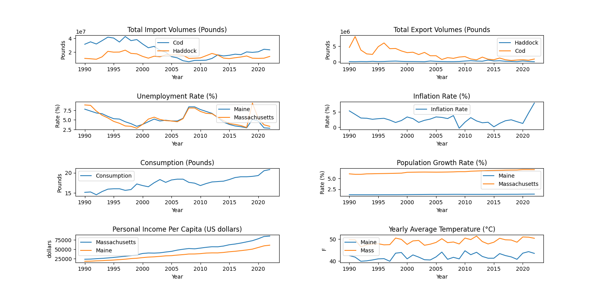

- Unemployment Rate: Represent the unemployment rates between Maine and Massachusetts over time 
- Inflation: General trend of the inflation rate and any notable fluctuations or differences between the two states.
- Personal Income Per Capita: Compare the levels and growth rates of personal income per capita for Maine and Massachusetts, .
- product Consumption per capita: product consumption in United States 
- Temperature : The average temperature of Maine and Massachusets as an indicator for climate change

### Building Predective Model Challenges
We encountered overfitting or multicollinearity issues when using simple linear regression, as evidenced by a large gap between the train and test R-squared values. This suggests that the model is too complex or the independent variables are highly correlated, leading to poor generalization performance.

To address these issues, we considered ridge regression, which adds a regularization term to the loss function. This regularization helps to shrink the coefficients towards zero, reducing the model's complexity and mitigating overfitting. By tuning the regularization parameter through cross-validation, we aim to find a balance between fitting the training data well and achieving good generalization performance on unseen data.

Ridge regression provides a way to tackle the overfitting and multicollinearity problems encountered in our simple linear regression model. By applying this regularization technique, we hope to improve the model's ability to generalize and obtain more reliable predictions.


### Technical Overview of The Model

In our model, we used Ridge Regression to predict the average price of cod and haddock based on several correlated features. Ridge Regression is a linear regression technique that addresses the problem of multicollinearity in the input features. Multicollinearity occurs when the predictor variables are highly correlated with each other, leading to unstable and unreliable coefficient estimates in ordinary least squares (OLS) regression.

In this model, RidgeCV for Ridge Regression, which automatically selects the best regularization parameter (alpha) from the provided range using cross-validation. This approach is systematic and leverages data-driven insights to optimize the regularization strength, mitigating overfitting while preserving the model's ability to generalize.

Ridge Regression is used instead of plain Linear Regression to handle multicollinearity among features and to prevent overfitting, especially when the number of features is large relative to the number of observations. If the features are highly correlated, as will suggest by the correlation matrix in the next section, Ridge helps by shrinking the coefficients, thus reducing model complexity.

 In our regression model, we implemented a complete pipeline for regression analysis on a dataset to predict a target variable (Average price of domestic Cod and Haddock per pound), leveraging several powerful tools from the Python data science libraries. Here’s a explanation of the main components of the model and their functionality:

### Feature Correlation 

- Correlation Matrix 

Before start the analysis, we calculate and visualize the correlation matrix for the features in our dataset. This helps in understanding the relationships between different features, which can inform feature selection.


- Feature Selection 

We employed a Sequential Feature Selector with a Linear Regression model to identify a subset of features that contribute most effectively to predicting the target variable. This method adds features one-by-one based on their significance in improving model performance, evaluated through cross-validation(scikit-learn developers, n.d).


### Model Building and Evaluation

Linear Regression with Selected Features
After identifying important features, we fit a simple linear regression model to each feature individually to assess their individual predictive power by calculating R-squared scores.

- Standard Scaling

We scale the selected features using StandardScaler to standardize the data, which is crucial for many machine learning models to perform well.

- Ridge Regression

We implement Ridge Regression with cross-validation over different alpha values (regularization strengths) to find the optimal model. This helps prevent overfitting by introducing a penalty term to the loss function based on the magnitude of the coefficients.

- Model Evaluation

We evaluate the model using metrics such as R-squared, Mean Squared Error (MSE), and Mean Absolute Error (MAE) for both training and testing sets to understand the model's performance and its generalization capability.

### Regression Function

Function Display

The regression function, combining the intercept and coefficients learned by the Ridge Regression model, is displayed. This function represents the learned linear relationship between the selected features and the target variable.

### Residual Analysis

- Normality Tests 

We perform the Shapiro-Wilk test to check if the residuals of the model (differences between observed and predicted values) follow a normal distribution. This is important for certain statistical assumptions in regression analysis.

- Visualizations of Residuals 

Finally, we plot residuals against predicted values to visually inspect any patterns that might indicate issues with the model (like heteroscedasticity or outliers). Additionally, you provide histograms and Q-Q plots to further analyze the distribution of residuals.


## Results
The average prices of cod and haddock appear to be more strongly correlated with external factors specific to each fish type, rather than being highly correlated with each other. Here is the heatmap that shows the correlation between the factors in the dataset:

 The following command...
```
make codreg
```
Produces the Heatmap along woth statistical result for the prediction of Cod average price...


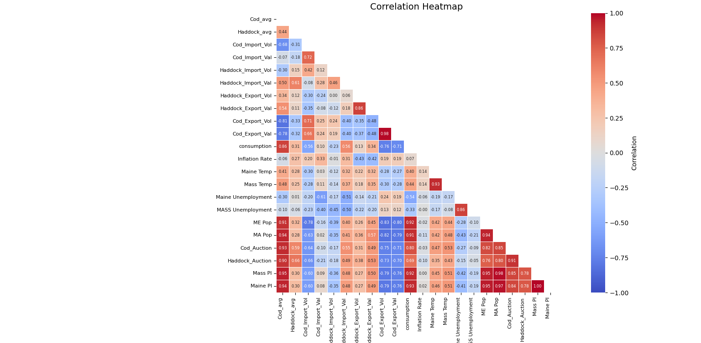

### Feature Correlations

For cod, the average landing price exhibits a significant correlation with the auction price, suggesting that the demand and price dynamics at auctions have a substantial influence on the average price fishermen receive for their catch. Additionally, factors such as population growth rate and personal income levels demonstrate a strong effect on the average price of cod. As the population increases and personal incomes rise, the demand for cod tends to grow, leading to higher average prices. Furthermore, consumption levels and export value show moderate positive correlations with the average cod price, indicating that overall consumption patterns and the value of cod exports also contribute to determining the average price. These findings highlight the complex interplay of various market forces, including auction dynamics, demographic factors, consumption trends, and international trade, in shaping the average landing price of cod.

The strong negative relation between the average cod price and both cod import volume and cod export volume can be attributed to the basic economic principles of supply and demand:

- As cod import volume increases, the domestic supply of cod rises, leading to a decrease in the average price due to increased competition and availability in the market.
- Similarly, when cod export volume increases, it suggests that there is a surplus of cod in the domestic market, which can drive down the average price as producers seek to sell their excess supply in international markets.
- The total yearly value of imported shows the effect of the exteral economic and social factors rather than the fishery.
 

For haddock, the correlations imply that the average price of haddock is primarily influenced by import and export of the Cod. This implies that the market of domestic Haddock is dominated by the market of Cod in new England. This means, by any changes in price of Cod, we expect to have a change in the price of domestic Haddock. 


- When the export price of haddock increases, it can lead to an increase in the domestic price of cod for several reasons:
Substitution effect: Cod and haddock are often seen as substitute products. If haddock becomes more expensive to export, consumers may switch to cod as a cheaper alternative, increasing the demand and price for cod in the domestic market.

- Bycatch effect: Cod and haddock are frequently caught together. If fishers target haddock more due to higher export prices, it may result in increased bycatch of cod, affecting its supply and price in the domestic market.

- Market perception: Higher export prices for haddock may be seen as an indicator of strong global demand for whitefish, including cod, leading to price adjustments in the domestic cod market.

- The total yearly value of imported shows the effect of the exteral economic and social factors rather than the fishery.

### Imported Landing Value Analysis
The strong positive correlation between the import values of cod and haddock suggests that they are closely linked and influenced by similar factors such as Maine and Massachusetts population growth rate, Inflation rate, personal income and the condition of exports. This could be due to several reasons:

- Similar market conditions: The demand for both cod and haddock in the importing countries may be driven by similar market conditions, such as consumer preferences, economic factors, or seasonality.

- Shared supply sources: Cod and haddock may be imported from the same or similar fishing regions(Northeast Atlantic), leading to a strong correlation in their import values.

- Complementary products: In some markets, cod and haddock may be seen as complementary products, where an increase in the import of one species is accompanied by an increase in the import of the other.

- The moderate correlations between the import values and the average prices of cod and haddock suggest that the import values are not strongly influenced by the domestic prices of these fish. This could indicate that the import values are more dependent on international market conditions and the prices in the exporting countries.


The following command...
```
make hadreg
```
Produces the statistical result prediction of Haddock average price...


### Feature Selection

For Cod model, the image shows the R-squared scores for different features when selected sequentially using a forward feature selection method with linear regression and 5-fold cross-validation. The Massachusets Personal Income (Mass PI) feature has the highest R-squared score, followed by Maine Population (MA Pop), Cod Auction Price (Cod_Auction) and consumption. This suggests that these four features are the most important predictors for the target variable based on the sequential feature selection process.

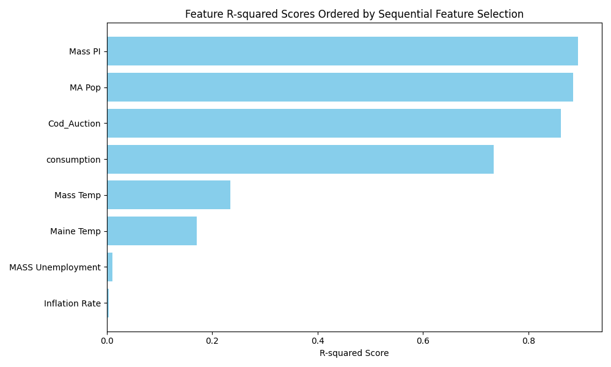

The following image shows the R-squared scores for different features for Hadock when selected sequentially. The Haddock Auction Price (Haddock_Auction) has the highest R-squared score, followed by consumption and Personal Income (Mass PI). This suggests that these three features are the most important predictors for the target variable, which is likely related to haddock prices or demand, based on the sequential feature selection process.

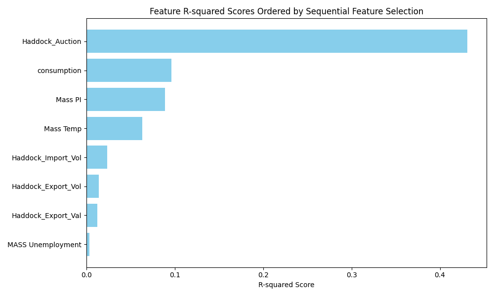

### Ridge Regression with Cross-Validation

Ridge Regression with Cross-Validation, is a method used to address the problem of multicollinearity in linear regression models by adding a degree of bias to the regression estimates. Here’s a breakdown of the model:

- Ridge Regression: It modifies linear regression by introducing a penalty (alpha or Lambda) on the size of coefficients(( ISL, p.241)). After training the ridge_model with our data (X_train, y_train), the model evaluates different alpha values specified by np.logspace(-3, 3, 100).

- Ridge_model.alpha_ provides the optimal alpha value. This value is what the model determined as the best balance between fitting the data well and keeping the model complexity low to avoid overfitting.

- Cross-Validation: The method uses cross-validation ( 5-fold) to find the optimal value of alpha. The dataset is divided into 5 parts, with each part used once as a test set while the others form the training set. This process is repeated for each alpha in a predefined range (np.logspace(-3, 3, 100)), and the alpha that results in the best average performance across the folds is chosen.

By introducing a penalty, ridge regression reduces the model’s likelihood of overfitting and mulltilinearity, which is crucial for building robust models that generalize well on unseen data.


### Residuals Analysis

To evaluate the reliability of the model, the Shapiro-Wilk test was employed to check if the residuals from our model follow a normal distribution. The Shapiro-Wilk test provides a way to statistically test the normality assumption(SciPy community, n.d). 

### Cod

In our model, the test statistic is 0.92 and the p-value (0.54) is greater than the commonly used significance level of 0.05. This means that the model fails to reject the null hypothesis, which states that the data (residuals) are normally distributed.

This result supports the reliability of the model because it suggests that the residuals follow a normal distribution, which is a crucial assumption for many statistical models. When this assumption holds, the model's inferences and predictions are more reliable and accurate.

The following scatter plot of residuals vs. predicted values shows a random scatter of points around the horizontal line at 0, without any clear patterns or trends. This is a good indication that the linear regression model fits the data well, as the residuals appear to be randomly distributed with no systematic bias.

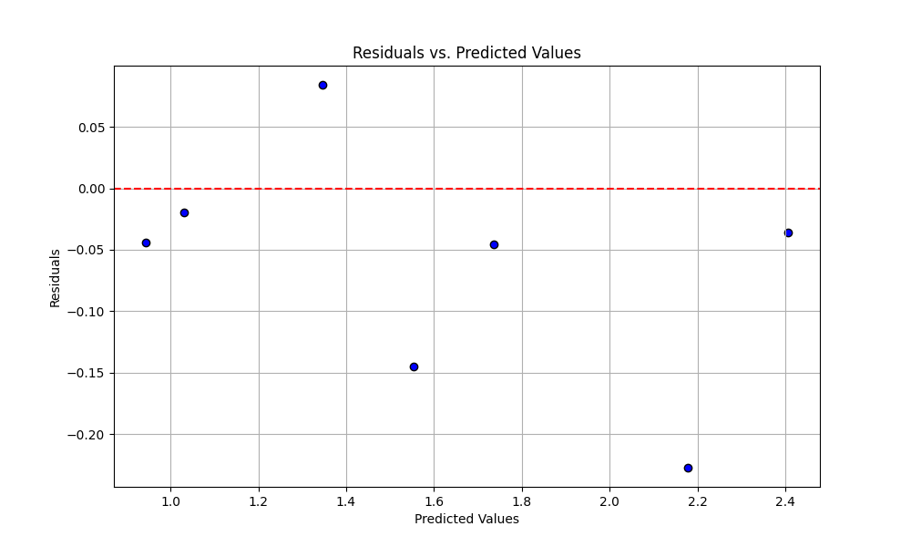

The Q-Q (Quantile-Quantile) plot compares the distribution of residuals against the expected distribution under normality. The points in the plot generally follow the diagonal line, suggesting that the residuals are approximately normally distributed. 

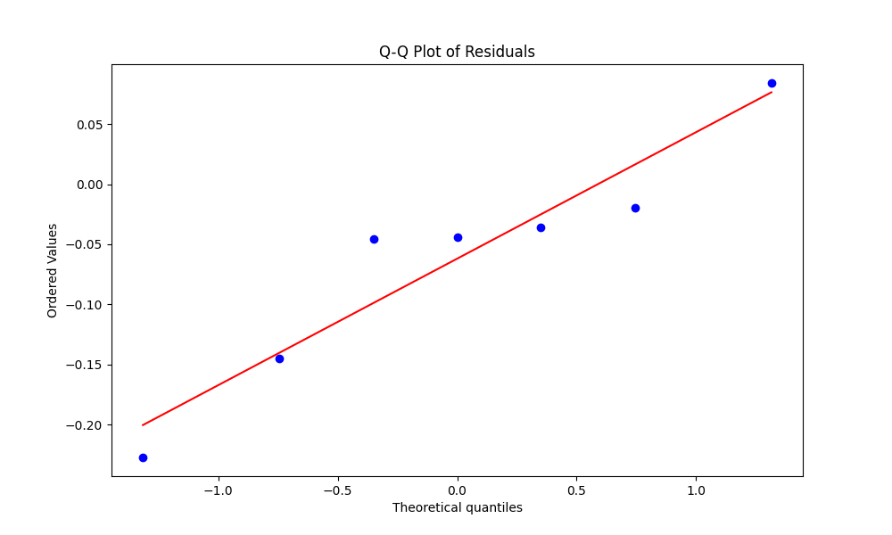

The histogram of residuals shows the distribution of residuals from the regression model. The histogram appears to be approximately bell-shaped and symmetric, which is consistent with the assumption of normally distributed residuals. The peak of the histogram is centered around 0, further supporting the random scatter of residuals observed in the past graphs.

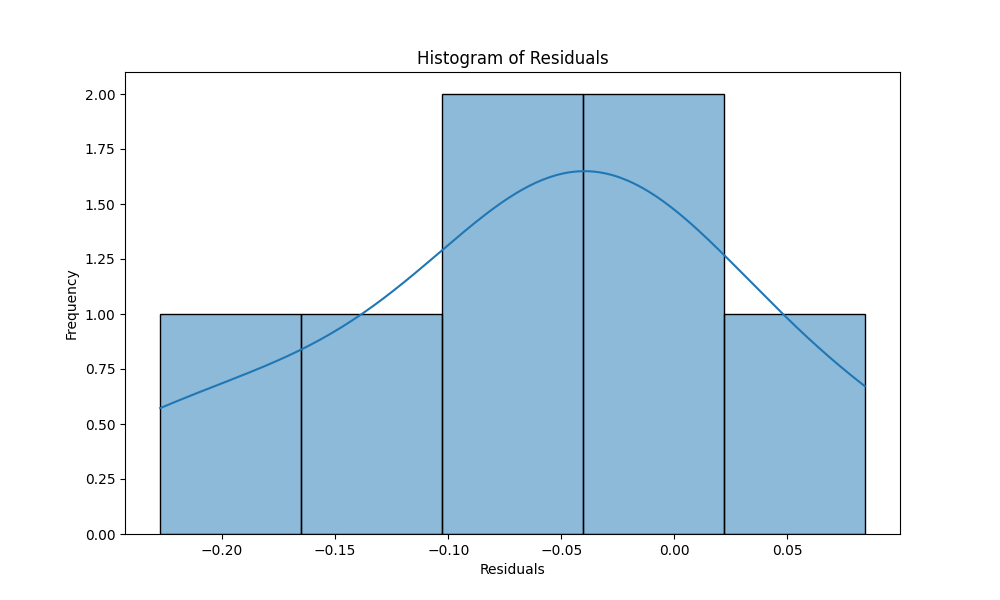


### Haddock

In this model, the test statistic is 0.95, and the p-value is 0.80. The interpretation is based on the p-value and a chosen significance level (commonly 0.05). Since the p-value is greater than the significance level of 0.05, we fail to reject the null hypothesis. The null hypothesis in the Shapiro-Wilk test is that the data is normally distributed. Therefore, the conclusion based on this test implies that the data is normally distributed.

The test results for Haddock support the reliability of the model because it suggest that the residuals follow a normal distribution and show that the model's inferences and predictions are preferably reliable and accurate.

The following image is a scatter plot of Residuals vs. Predicted Values of Hadock. The residuals appear to be randomly scattered around zero, indicating a good model fit with no clear patterns or trends.

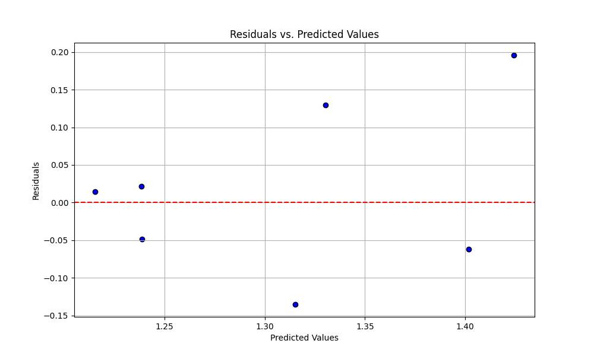

The following image is a Histogram of Residuals of Haddock. The histogram has a roughly symmetric bell-shaped curve centered around zero, suggesting that the residuals are approximately normally distributed, which is a desirable property for many statistical models.

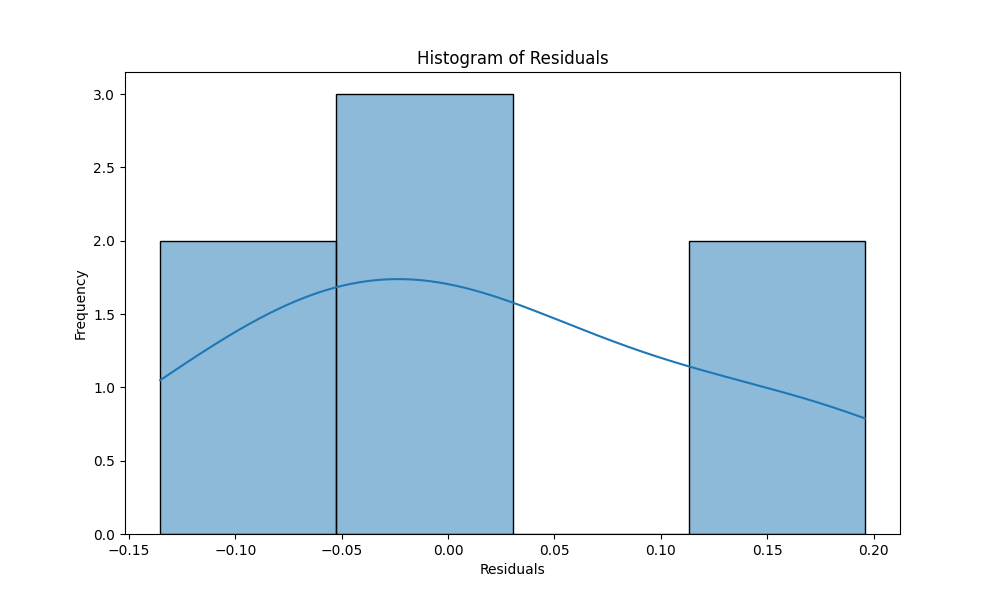

The following image is a Q-Q Plot of Residuals for Haddock. It compares the quantiles of the residuals to the quantiles of a theoretical normal distribution. The points in the plot follow a roughly straight line, indicating that the residuals are approximately normally distributed. 

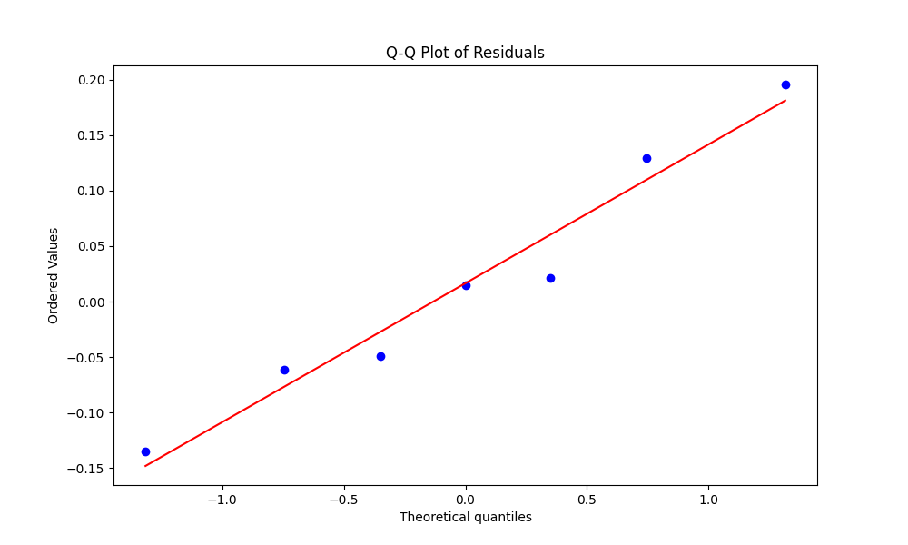

### Regression Functions

### Cod

The intercept (1.528) represents the predicted value of the dependent variable when all independent variables are zero.
The coefficients for each independent variable indicate the change in the dependent variable associated with a one-unit change in the respective independent variable, holding all other variables constant:
- Consumption (0.007): positive relationship
- Inflation Rate (-0.030): negative relationship
- Maine Temperature (-0.019): negative relationship
- Massachusetts Temperature (0.007): positive relationship
- Massachusetts Unemployment (0.029): positive relationship
- Massachusetts Population (0.147): positive relationship
- Massachusetts Personal Income (0.229): positive relationship
- Cod Auction (0.247): positive relationship

The magnitudes of the coefficients indicate the strength of the relationships, with Massachusetts personal income and cod auction having the largest positive effects, and inflation rate having the most substantial negative impact. 

### Haddock

The intercept (1.296) represents the predicted value of the dependent variable when all independent variables are zero. 

- Haddock Import Volume (0.041): positive relationship
- Haddock Export Volume (0.012): positive relationship
- Haddock Export Value (-0.030): negative relationship
- Consumption (-0.002): negative relationship
- Mass Temperature (0.016): positive relationship
- Mass Unemployment (0.010): positive relationship
- Mass Personal Income (-0.015): negative relationship
- Haddock Auction (0.131): positive relationship

The magnitudes of the coefficients indicate the strength of the relationships, with Haddock Auction having the largest positive effect, and Haddock Export Value having the most substantial negative impact.

### Analysis of trends in 2023

From 2023 to 2024, we observe significant changes in the trends of import, export, and auction prices. The value of cod dropped by half in 2023( Cod Scord from 2.05 to 1.36) and we observe a slight decrease in the price of Haddock Large from (2.61 to 2.31) along with a substantial decrease in the import volume for both species. In contrast, we witness a sharp increase in the export volume of cod and a slight increase in the export of haddock. These changes may be attributed to the new fishing regulations for cod in New England, which have led to a decrease in the catch rates of both species, as the condition of the cod population is dominant in influencing the overall fishery. Consequently, the auction prices for both cod and haddock have been affected, reflecting the shifting dynamics between domestic catch, import, and export trends in the New England groundfish fishery. 


## Conclusion

The recent trends in import, export, and auction prices from 2023 to 2024 highlight significant shifts in the New England groundfish fishery. The drastic drop in the value of cod in 2023, accompanied by a slight decrease in the price of large haddock, reflects the impact of new fishing regulations on catch rates and market dynamics. These changes, particularly in export volumes and auction prices, underscore the influence of policy changes and the condition of cod populations on the overall fishery.

The predictive model indicates that the competition between domestic and imported groundfish markets is closely linked to population and per capita personal income. Economic factors, along with climate change and warming waters, may significantly affect the supply and pricing of cod and haddock. The market dynamics in New England are dominated by the domestic cod market, and the scarcity of domestic Atlantic cod leads to an increase in imported products, resulting in an imbalance in the market.

The following command...
```
make conclusion
```
Produces the plot that proves the predective model findings...


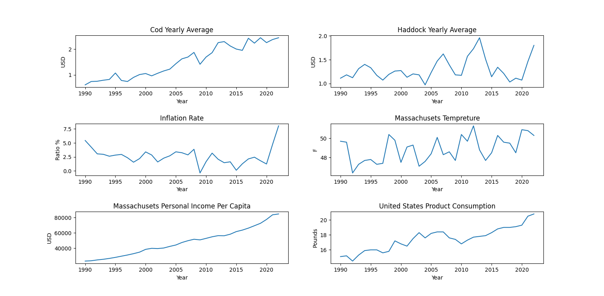

The graph illustrates that cod prices and personal income have followed a nearly linear increase over the past 33 years. This strong correlation allows the model to perform extremely well when using personal income as an input variable, explaining the high R-squared value observed. This suggests that as the cost of living increases, it exerts pressure on personal income; consequently, the demand for cod drops in the market, the imported volume drops and the average price decreases. In contrast, when the cost of living decreases, the demand for cod rises due to consumers' increased affordability in the market. The scarcity of cod in the market, resulting from limitations in domestic catching, leads to an increase in imports, and the average price is expected to increase.

Before 2023, the observed increase in import values for both cod and haddock suggests a growing reliance on imported products to meet market demand. This trend, coupled with potential supply constraints and price fluctuations in domestic production, could intensify competition between domestic and imported products in the New England area. However, domestic production remains essential, provided it can ensure consistent supply and competitive pricing. The dynamics between domestic and imported products will be influenced by a range of factors, including supply chain resilience, economic conditions, and consumer behavior.

Looking ahead, it is likely that imported cod and haddock will face increasing competition, driven by growing import values and evolving consumer preferences. While imported products may play a significant role in meeting market demand, the sustainability and competitiveness of domestic production will continue to be pivotal in shaping the future of the New England groundfish fishery. Industry stakeholders must adapt to these evolving dynamics and leverage insights from economic analysis to navigate the complexities of the seafood market effectively.


## References:

Portland Fish Exchange. Retrieved  from  https://www.pfex.org/price-landing-tool/

NOAA Landings and Foreign Trade: NOAA Fisheries. Retrieved from  https://www.fisheries.noaa.gov/foss/f?p=215:2:5473541341067

Climate Change Data: IMF. Retrieved from https://climatedata.imf.org/pages/climatechange-data#cc3

FRED Economic Data. Retrieved from https://fred.stlouisfed.org/

James, G., Witten, D., Hastie, T., Tibshirani, R., & Taylor, J. (2023). An introduction to statistical learning: With applications in python. Springer Nature.

The SciPy community. (n.d). scipy.stats.shapiro . Retrieved from https://docs.scipy.org/doc/scipy/reference/generated/scipy.stats.shapiro.html

scikit-learn developers.(n.d). sklearn.feature_selection.SequentialFeatureSelector. Retrieved from https://scikit-learn.org/stable/modules/generated/sklearn.feature_selection.SequentialFeatureSelector.html


